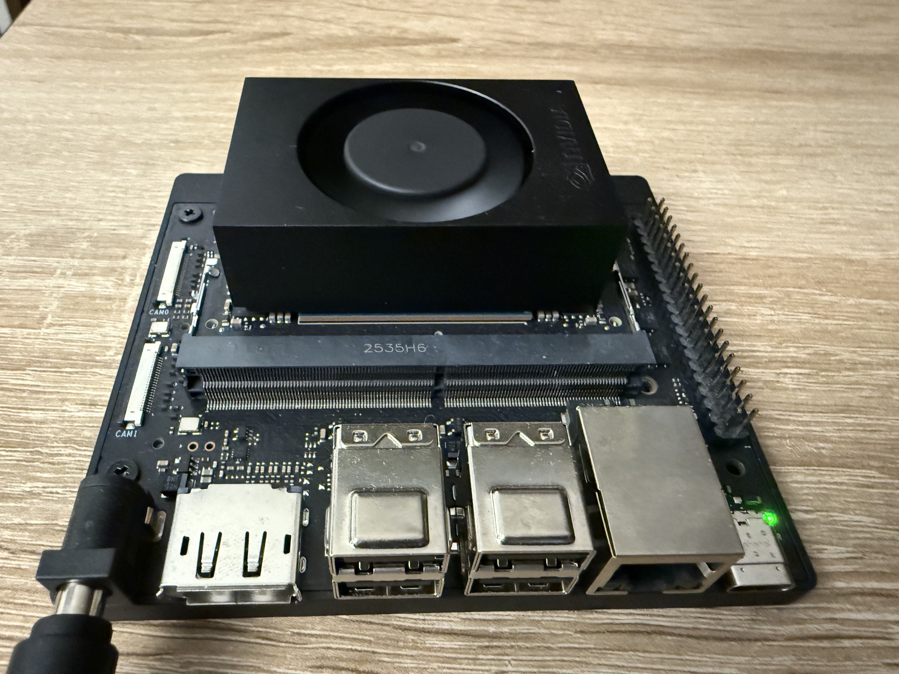
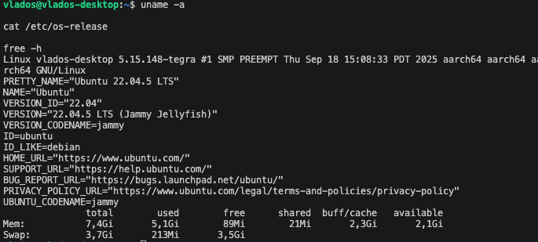
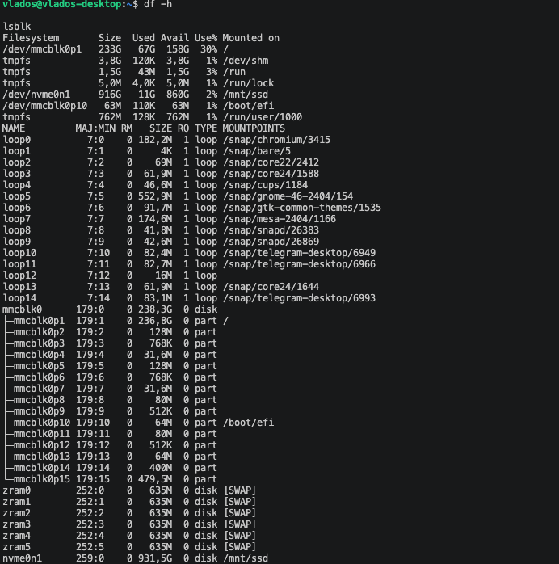
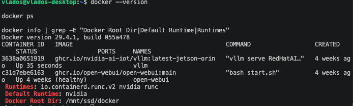
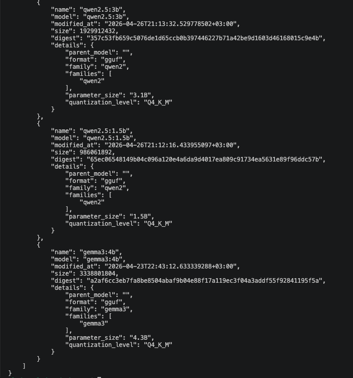
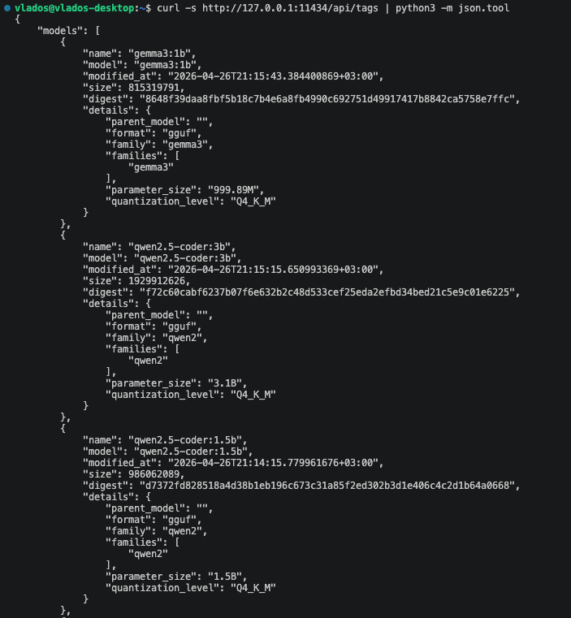
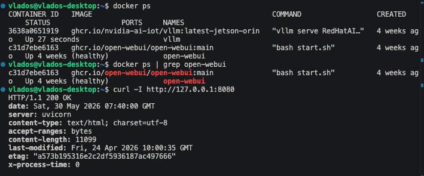
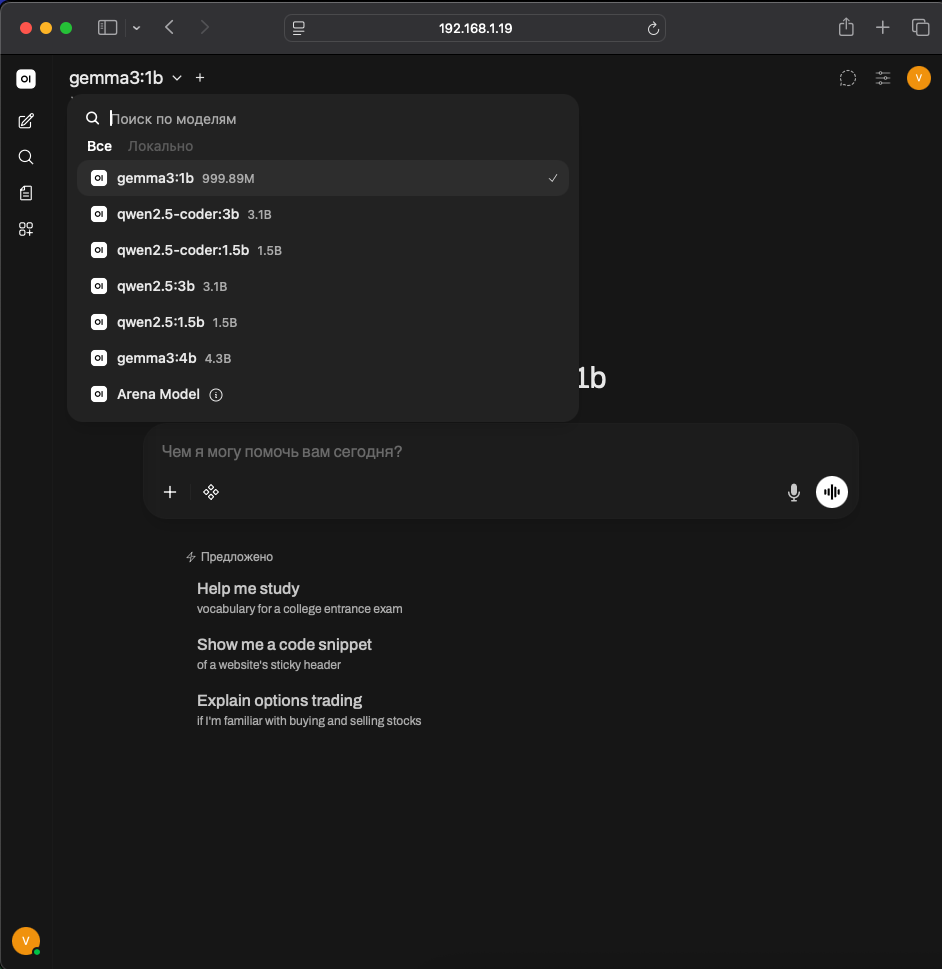
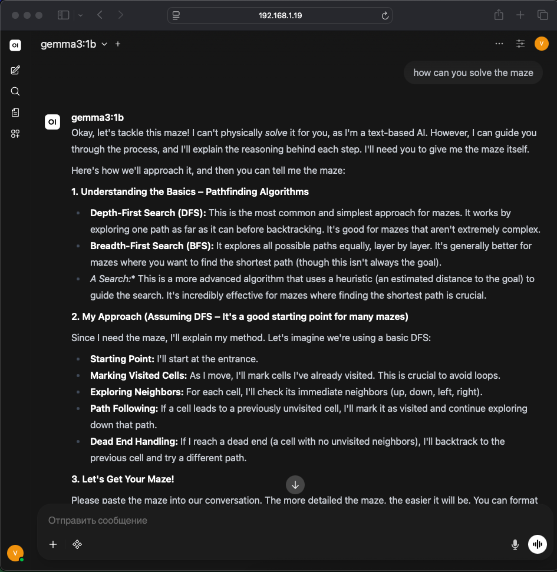

# Jetson Orin Nano AI Server



A practical local AI server built on **NVIDIA Jetson Orin Nano 8GB** using **Docker**, **Ollama**, and **Open WebUI**.

This project is my attempt to turn a small edge AI device into a usable local LLM server that can run on my own hardware and be accessed from a browser over the local network.

The project is not only about installing a web interface. The main goal was to understand how Jetson Orin Nano behaves as a real local AI machine: how to deploy the software, where the storage bottlenecks are, what model sizes are realistic, what breaks, and how this setup can later become part of a robotics stack.

---

## Why I Built This

I wanted a local AI server that could be used as a base for:

- local LLM experiments;
- a private AI chatbot;
- a robotics assistant backend;
- future integration with Raspberry Pi + Hailo devices;
- experiments with edge AI and small local models;
- a portfolio project showing real hardware setup, not only code.

Jetson Orin Nano is interesting because it is a compact edge AI device. It is small enough to be used in robotics projects, but powerful enough to run real AI workloads when the setup is chosen carefully.

The important practical question was:

> Can I make Jetson Orin Nano 8GB work as a stable local AI server with a browser interface?

The answer is: yes, but with realistic expectations about memory, model size, storage, and runtime stability.

---

## What I Used

### Hardware

- NVIDIA Jetson Orin Nano 8GB
- SSD / NVMe storage
- Local network connection
- MacBook / laptop for browser access, SSH, and VS Code Remote SSH

### Software

- Linux / JetPack on Jetson
- Docker
- Ollama
- Open WebUI
- Local LLM models

---

## External Sources I Used

During this setup I used and compared information from several sources:

- NVIDIA Jetson Orin Nano Developer Kit documentation  
  https://developer.nvidia.com/embedded/learn/get-started-jetson-orin-nano-devkit

- NVIDIA Jetson Orin Nano Developer Kit User Guide  
  https://developer.nvidia.com/embedded/learn/jetson-orin-nano-devkit-user-guide

- NVIDIA Jetson Orin Nano product information  
  https://www.nvidia.com/en-us/autonomous-machines/embedded-systems/jetson-orin/nano-super-developer-kit/

- Jetson AI Lab tutorials  
  https://www.jetson-ai-lab.com/

- Open WebUI documentation  
  https://docs.openwebui.com/

- Open WebUI GitHub repository  
  https://github.com/open-webui/open-webui

- Ollama documentation  
  https://docs.ollama.com/

- Ollama API documentation  
  https://docs.ollama.com/api

These sources helped me understand the expected architecture: Jetson as an edge AI device, Ollama as the local model runtime, Open WebUI as the browser interface, and Docker as the deployment layer.

---

## Project Overview

The final idea is simple:

```text
Laptop / Browser
       |
       | Local Network
       v
Jetson Orin Nano
       |
       | Docker
       v
Open WebUI  --->  Ollama  --->  Local LLM Models
       |
       v
SSD Storage
```

Open WebUI provides the browser interface.  
Ollama runs local language models.  
Docker is used to deploy Open WebUI.  
SSD storage is used to avoid filling the main system storage with containers, volumes, and model files.

---

## What I Actually Did

### 1. Checked the Jetson system

I first checked the operating system, kernel, memory, and storage.

Useful commands:

```bash
uname -a
cat /etc/os-release
free -h
df -h
lsblk
```

This helped confirm the system state and whether the SSD was visible and mounted.

Example system check:


SSD / NVMe storage check:


---

### 2. Set up Docker

Docker was used because Open WebUI is easy to run and maintain as a container.

Useful checks:

```bash
docker --version
docker ps
docker ps -a
docker info | grep -E "Docker Root Dir|Default Runtime|Runtimes"
```

One of the important points was storage. AI-related containers and model files can grow quickly, so I wanted heavy data to be stored on SSD instead of filling the main system storage.

Docker status and runtime check:


---

### 3. Set up Ollama

Ollama was used as the local LLM backend.

The basic API check:

```bash
curl http://127.0.0.1:11434/api/tags
```

This command returns locally available models and confirms that Ollama is running.

Ollama local API test:
 



---

### 4. Ran Open WebUI

Open WebUI running as a Docker container:



Open WebUI was used as the browser-based interface for the local LLM server.

Example Docker command:

```bash
docker run -d \
  --network=host \
  --name open-webui \
  --restart always \
  -e OLLAMA_BASE_URL=http://127.0.0.1:11434 \
  -v /mnt/ssd/open-webui:/app/backend/data \
  ghcr.io/open-webui/open-webui:main
```

Why these options are useful:

- `--network=host` allows Open WebUI to use the Jetson network directly.
- `--restart always` makes the container restart automatically.
- `OLLAMA_BASE_URL=http://127.0.0.1:11434` connects Open WebUI to local Ollama.
- `/mnt/ssd/open-webui:/app/backend/data` stores Open WebUI data on SSD.

---

### 5. Tested local network access

From the Jetson itself:

```bash
curl -I http://127.0.0.1:8080
```

From another device in the same network:

```text
http://JETSON_IP:8080
```

Example:

```text
http://192.168.1.19:8080
```

This made it possible to use Jetson as a small local AI server from a laptop browser.

Open WebUI accessible from another device in the local network:




---

## Current Status

Implemented:

- Docker is installed and working.
- Open WebUI is running in Docker.
- Open WebUI is accessible from the local network.
- Ollama API was tested.
- Basic local models were tested.
- SSD storage is used for heavier data such as Docker volumes and model files.
- Practical model limits for Jetson Orin Nano 8GB were evaluated.

---

## Model Testing Notes

The most important practical lesson: **Jetson Orin Nano 8GB is useful, but model size matters a lot.**

This device is not a desktop GPU workstation. It is an edge AI device with limited memory, so large LLMs can fail or become unstable.

### Practical observations

| Model Size | Result |
|---|---|
| 1B | Comfortable for lightweight local tasks |
| 3B | Realistic for local chat |
| 4B | Possible depending on quantization and runtime |
| 7B | Often too heavy or unstable on this setup |

Observed problem with larger models:

```text
cudaMalloc failed: out of memory
llama runner process has terminated
```

### Conclusion

For Jetson Orin Nano 8GB, smaller models are usually better for stability.

The most realistic range is around **1B–4B parameters**, depending on:

- the exact model;
- quantization;
- memory usage;
- runtime configuration;
- whether other services are running at the same time.

For this setup, stability is more important than chasing the largest possible model.

---

## Useful Commands

### System

```bash
uname -a
cat /etc/os-release
free -h
df -h
lsblk
```

### Docker

```bash
docker --version
docker ps
docker ps -a
docker info | grep -E "Docker Root Dir|Default Runtime|Runtimes"
```

### Ollama

```bash
curl http://127.0.0.1:11434/api/tags
```

### Open WebUI

```bash
curl -I http://127.0.0.1:8080
docker ps
docker logs open-webui
docker restart open-webui
```

---

## Troubleshooting

### Open WebUI is not opening

Check whether the container is running:

```bash
docker ps
```

Check logs:

```bash
docker logs open-webui
```

Restart the container:

```bash
docker restart open-webui
```

---

### Ollama API does not respond

Check the Ollama API:

```bash
curl http://127.0.0.1:11434/api/tags
```

If Ollama is running as a system service, check its status:

```bash
systemctl status ollama
```

Restart Ollama:

```bash
sudo systemctl restart ollama
```

---

### Open WebUI container already exists

If the container already exists and needs to be recreated:

```bash
docker stop open-webui
docker rm open-webui
```

Then run the Open WebUI Docker command again.

---

### Model fails with out of memory

Use a smaller model.

On Jetson Orin Nano 8GB, 7B models are often not practical. Smaller models are more stable and better suited for this device.

---

## What I Learned

This project helped me understand several practical things:

- Running local AI on edge hardware is possible, but the setup must be realistic.
- Storage planning matters because Docker data and model files can become large.
- A web interface like Open WebUI makes local models much easier to use.
- Ollama provides a simple local API for model management and testing.
- Jetson Orin Nano 8GB is better suited for smaller efficient models than for large LLMs.
- For robotics projects, a stable small model can be more useful than a large unstable one.

---

## Possible Use Cases

This setup can be used for:

- local AI chatbot;
- private local LLM experiments;
- robotics assistant backend;
- local coding assistant experiments;
- offline AI testing;
- edge AI portfolio project;
- future integration with Raspberry Pi + Hailo devices;
- local AI interface for robots or smart devices.

---

---

## Why This Project Matters

This project shows how a compact edge AI device can be configured as a practical local AI server.

The value of the project is not just that Open WebUI was installed. The value is in the full process:

- preparing the hardware;
- checking the operating system;
- configuring Docker;
- connecting Open WebUI to Ollama;
- moving heavy data to SSD;
- testing local models;
- finding realistic model limits;
- documenting what works and what does not.

This creates a reusable base for future AI and robotics experiments.

